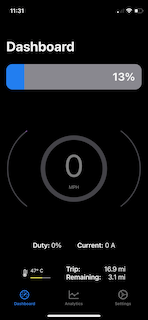
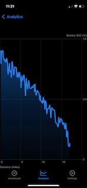
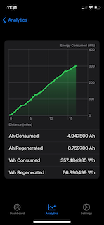
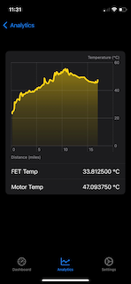

# Onewheel-SwiftUI

An experiment of mine, making a Swifty app to monitor my VESC'd Onewheel while riding.

:warning: This code is fairly gross and was thrown together in a weekend, I don't recommend anyone learns from or uses this repo.

[Video](https://youtu.be/qgTjDOrlvz8)

